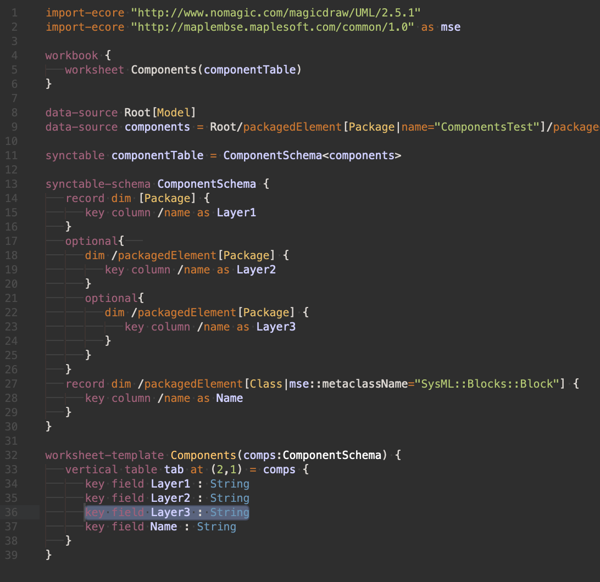

# MSE Sample Configurations and Sublime Text 3 Syntax

### Sample Configurations
Share and collaboratively develop useful MapleMBSE configurations

**SST**
 - Configurations for SST (SysMLv2 Submission Team)

### [Sublime Text 3 Syntax](sublime-syntax)

### License
This project is under the Apache license.
