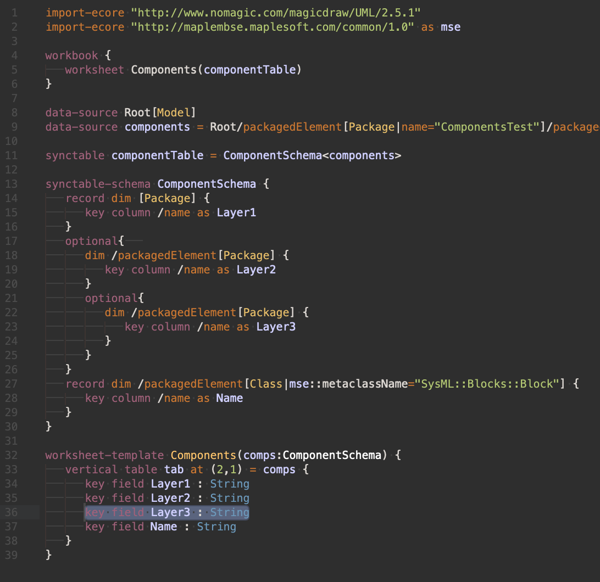

# MapleMBSE MSE Configuration Syntax for Sublime Text 3

## Install

Available through Package Control as `MapleMBSE MSE Configuration` .

In Sublime Text 3, open the Command Palette and search "Package Control: Install Package" > "MapleMBSE MSE Configuration".
